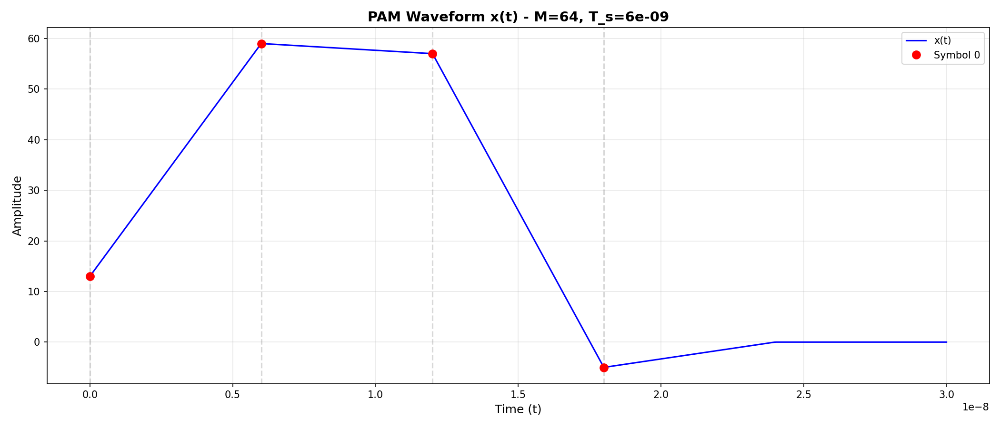
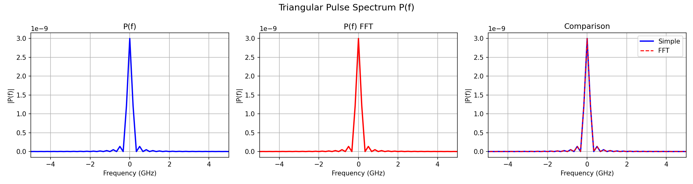
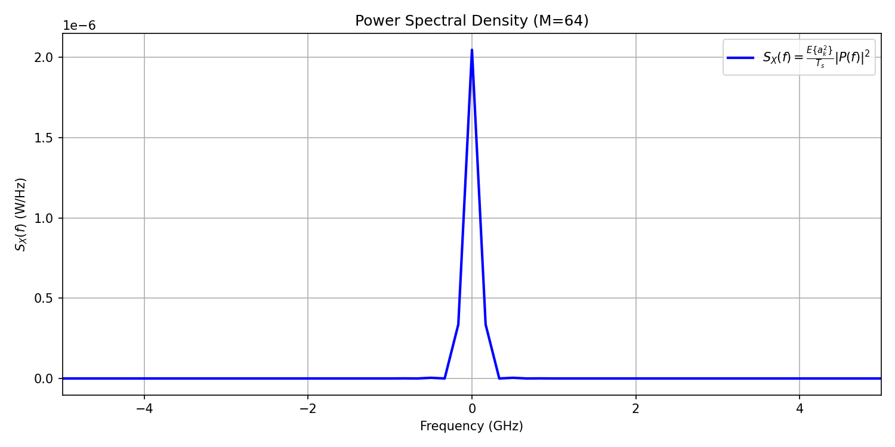

# PAM Communication System - Τηλεπικοινωνιακά Συστήματα

## Environment Setup

### Prerequisites
- Python 3.8 or higher
- pip (Python package manager)

### Installation Steps

1. **Create a virtual environment (recommended):**
   
   **On Windows:**
   ```powershell
   python -m venv pam-waveform
   pam-waveform\Scripts\Activate.ps1
   ```
   
   **On macOS/Linux:**
   ```bash
   python3 -m venv pam-waveform
   source pam-waveform/bin/activate
   ```

2. **Install dependencies:**
   ```bash
   pip install -r requirements.txt
   ```

3. **Verify installation:**
   ```bash
   python -c "import numpy; import matplotlib; print('Dependencies installed successfully!')"
   ```

### Requirements
- `numpy == 2.4.1` - Numerical computing library
- `matplotlib == 3.10.8` - Plotting and visualization library

### Output Directory
The `output/` folder is used to store generated plots. It will be created automatically when running the scripts if it doesn't exist.

---

## Εισαγωγή
- p = 8 (τελευταίο ψηφίο ΑΜ)
- M = 64 (επίπεδα πλάτους)
- Bits per symbol = 6
- Bit rate = 1 Gbit/s

**Κυματομορφή PAM:**
$$x(t) = \sum_k a_k \cdot p(t - kT_s)$$

**Πλάτος συμβόλου:**
$$A_m = \beta(2m - M + 1), \quad 0 \leq m \leq M-1, \quad \beta = 1$$

---


## Εκτέλεση

```bash
# Μέρος Α
python i_graycode.py
python i_graycode.py --test

# Μέρος Β
python ii_waveform.py [N] [T_s] [input_bits]
python ii_waveform.py 100 6e-9 "110101100011100010010011"

# Μέρος Γ
python iii_psd.py [N] [T_s]
python iii_psd.py 100 6e-9
```

---

## Δομή Αρχείων

```
communication-systems/
├── i_graycode.py      # Μέρος Α - Gray code
├── ii_waveform.py      # Μέρος Β - PAM waveform
├── iii_psd.py           # Μέρος Γ - PSD
├── output/            # Αποθήκευση γραφημάτων
│   ├── waveform_plot.png
│   ├── pulse_spectrum_comparison.png
│   └── psd_plot.png
└── README.md
```

---

## Μέρος Α - Gray Code (i_graycode.py)

### Μεθοδολογία
Αναδρομική και επαναληπτική υλοποίηση του κώδικα Gray για την αντιστοίχιση bit groups σε σύμβολα.

```python
gray_recursive(M: int) -> list[str]
# M = αριθμός bits
# Επιστρέφει 2^M Gray code words (list of strings)
```

### Αποτελέσματα

| M | Bits | gray_recursive() | gray_iterative() |
|---|------|------------------|------------------|
| 4 | 2 | `['00', '01', '11', '10']` | `['00', '01', '11', '10']` |
| 16 | 4 | `['0000', '0001', '0011', '0010', '0110', '0111', '0101', '0100', '1100', '1101', '1111', '1110', '1010', '1011', '1001', '1000']` | `['0000', '0001', '0011', '0010', '0110', '0111', '0101', '0100', '1100', '1101', '1111', '1110', '1010', '1011', '1001', '1000']` |
| 256 | 8 | `['00000000', '00000001', '00000011', '00000010', '00000110', '00000111', '00000101', '00000100', '00001100', '00001101', '00001111', '00001110', '00001010', '00001011', '00001001', '00001000', '00011000', '00011001', '00011011', '00011010', '00011110', '00011111', '00011101', '00011100', '00010100', '00010101', '00010111', '00010110', '00010010', '00010011', '00010001', '00010000', '00110000', '00110001', '00110011', '00110010', '00110110', '00110111', '00110101', '00110100', '00111100', '00111101', '00111111', '00111110', '00111010', '00111011', '00111001', '00111000', '00101000', '00101001', '00101011', '00101010', '00101110', '00101111', '00101101', '00101100', '00100100', '00100101', '00100111', '00100110', '00100010', '00100011', '00100001', '00100000', '01100000', '01100001', '01100011', '01100010', '01100110', '01100111', '01100101', '01100100', '01101100', '01101101', '01101111', '01101110', '01101010', '01101011', '01101001', '01101000', '01111000', '01111001', '01111011', '01111010', '01111110', '01111111', '01111101', '01111100', '01110100', '01110101', '01110111', '01110110', '01110010', '01110011', '01110001', '01110000', '01010000', '01010001', '01010011', '01010010', '01010110', '01010111', '01010101', '01010100', '01011100', '01011101', '01011111', '01011110', '01011010', '01011011', '01011001', '01011000', '01001000', '01001001', '01001011', '01001010', '01001110', '01001111', '01001101', '01001100', '01000100', '01000101', '01000111', '01000110', '01000010', '01000011', '01000001', '01000000', '11000000', '11000001', '11000011', '11000010', '11000110', '11000111', '11000101', '11000100', '11001100', '11001101', '11001111', '11001110', '11001010', '11001011', '11001001', '11001000', '11011000', '11011001', '11011011', '11011010', '11011110', '11011111', '11011101', '11011100', '11010100', '11010101', '11010111', '11010110', '11010010', '11010011', '11010001', '11010000', '11110000', '11110001', '11110011', '11110010', '11110110', '11110111', '11110101', '11110100', '11111100', '11111101', '11111111', '11111110', '11111010', '11111011', '11111001', '11111000', '11101000', '11101001', '11101011', '11101010', '11101110', '11101111', '11101101', '11101100', '11100100', '11100101', '11100111', '11100110', '11100010', '11100011', '11100001', '11100000', '10100000', '10100001', '10100011', '10100010', '10100110', '10100111', '10100101', '10100100', '10101100', '10101101', '10101111', '10101110', '10101010', '10101011', '10101001', '10101000', '10111000', '10111001', '10111011', '10111010', '10111110', '10111111', '10111101', '10111100', '10110100', '10110101', '10110111', '10110110', '10110010', '10110011', '10110001', '10110000', '10010000', '10010001', '10010011', '10010010', '10010110', '10010111', '10010101', '10010100', '10011100', '10011101', '10011111', '10011110', '10011010', '10011011', '10011001', '10011000', '10001000', '10001001', '10001011', '10001010', '10001110', '10001111', '10001101', '10001100', '10000100', '10000101', '10000111', '10000110', '10000010', '10000011', '10000001', '10000000']` | `['00000000', '00000001', '00000011', '00000010', '00000110', '00000111', '00000101', '00000100', '00001100', '00001101', '00001111', '00001110', '00001010', '00001011', '00001001', '00001000', '00011000', '00011001', '00011011', '00011010', '00011110', '00011111', '00011101', '00011100', '00010100', '00010101', '00010111', '00010110', '00010010', '00010011', '00010001', '00010000', '00110000', '00110001', '00110011', '00110010', '00110110', '00110111', '00110101', '00110100', '00111100', '00111101', '00111111', '00111110', '00111010', '00111011', '00111001', '00111000', '00101000', '00101001', '00101011', '00101010', '00101110', '00101111', '00101101', '00101100', '00100100', '00100101', '00100111', '00100110', '00100010', '00100011', '00100001', '00100000', '01100000', '01100001', '01100011', '01100010', '01100110', '01100111', '01100101', '01100100', '01101100', '01101101', '01101111', '01101110', '01101010', '01101011', '01101001', '01101000', '01111000', '01111001', '01111011', '01111010', '01111110', '01111111', '01111101', '01111100', '01110100', '01110101', '01110111', '01110110', '01110010', '01110011', '01110001', '01110000', '01010000', '01010001', '01010011', '01010010', '01010110', '01010111', '01010101', '01010100', '01011100', '01011101', '01011111', '01011110', '01011010', '01011011', '01011001', '01011000', '01001000', '01001001', '01001011', '01001010', '01001110', '01001111', '01001101', '01001100', '01000100', '01000101', '01000111', '01000110', '01000010', '01000011', '01000001', '01000000', '11000000', '11000001', '11000011', '11000010', '11000110', '11000111', '11000101', '11000100', '11001100', '11001101', '11001111', '11001110', '11001010', '11001011', '11001001', '11001000', '11011000', '11011001', '11011011', '11011010', '11011110', '11011111', '11011101', '11011100', '11010100', '11010101', '11010111', '11010110', '11010010', '11010011', '11010001', '11010000', '11110000', '11110001', '11110011', '11110010', '11110110', '11110111', '11110101', '11110100', '11111100', '11111101', '11111111', '11111110', '11111010', '11111011', '11111001', '11111000', '11101000', '11101001', '11101011', '11101010', '11101110', '11101111', '11101101', '11101100', '11100100', '11100101', '11100111', '11100110', '11100010', '11100011', '11100001', '11100000', '10100000', '10100001', '10100011', '10100010', '10100110', '10100111', '10100101', '10100100', '10101100', '10101101', '10101111', '10101110', '10101010', '10101011', '10101001', '10101000', '10111000', '10111001', '10111011', '10111010', '10111110', '10111111', '10111101', '10111100', '10110100', '10110101', '10110111', '10110110', '10110010', '10110011', '10110001', '10110000', '10010000', '10010001', '10010011', '10010010', '10010110', '10010111', '10010101', '10010100', '10011100', '10011101', '10011111', '10011110', '10011010', '10011011', '10011001', '10011000', '10001000', '10001001', '10001011', '10001010', '10001110', '10001111', '10001101', '10001100', '10000100', '10000101', '10000111', '10000110', '10000010', '10000011', '10000001', '10000000']` |

- Το αποτέλεσμα των δύο μεθόδων είναι -αναμενόμενα- ταυτόσημο για όλα τα δοκιμασμένα μεγέθη M.

### Benchmarks

Εκτέλεση με `python i_graycode.py --test`:

| Codes (2^M) | Bits (M) | Recursive Time(ms) | Recursive Heap(KB) | Recursive Stack(KB) | Iterative Time(ms) | Iterative Heap(KB) | Iterative Stack(KB) |
|-------------|----------|--------------------|--------------------|---------------------|--------------------|--------------------|---------------------|
| 4           | 2        | 0.024              | 0.29               | 0.97                | 0.013              | 0.39               | 0.48                |
| 16          | 4        | 0.029              | 1.36               | 1.94                | 0.028              | 1.62               | 0.48                |
| 256         | 8        | 0.268              | 23.25              | 3.88                | 0.242              | 24.66              | 0.48                |
| 1024        | 10       | 1.046              | 96.12              | 4.84                | 0.902              | 100.65             | 0.48                |
| 4096        | 12       | 4.572              | 399.50             | 5.81                | 4.954              | 416.13             | 0.48                |
| 16384       | 14       | 19.452             | 1635.19            | 6.78                | 17.558             | 1699.93            | 0.48                |
| 65536       | 16       | 73.200             | 6749.56            | 7.75                | 74.683             | 7006.41            | 0.48                |
| 262144      | 18       | 296.699            | 27827.56           | 8.72                | 289.160            | 28852.14           | 0.48                |
| 1048576     | 20       | 1225.874           | 114628.75          | 9.69                | 1284.198           | 118724.89          | 0.48                |
| 4194304     | 22       | 4824.690           | 467629.56          | 10.66               | 5651.427           | 484013.70          | 0.48                |

**Παρατηρήσεις:**
- Ο χρόνος εκτέλεσης είναι παρόμοιος και μπορεί να διαφέρει ανάλογα με τον αριθμό bits ή ανά εκτέλεση
- Η επαναληπτική μέθοδος χρησιμοποιεί λίγο περισσότερη μνήμη heap
- Η αναδρομική μέθοδος χρησιμοποιεί περισσότερη μνήμη stack (λόγω των recursive calls)
- Σε γενικό πλαίσιο δεν παρατηρούνται σημαντικές διαφορές στην απόδοση μεταξύ των δύο μεθόδων για τα δοκιμασμένα μεγέθη

## Μέρος Β - PAM Waveform (ii_waveform.py)

### Τυπολόγιο
**Τριγωνικός παλμός (συμμετρικός):**
$$p(t) = \begin{cases} 1 - \frac{2|t|}{T_s} & |t| \leq \frac{T_s}{2} \\ 0 & \text{αλλιώς} \end{cases}$$

### Μεθοδολογία

1. **Μετατροπή bits σε σύμβολα**: Χρήση Gray code για αντιστοίχιση bit groups → symbol index m
2. **Υπολογισμός πλατών**: A_m = β(2m - M + 1) με β=1
3. **Τριγωνικός παλμός**: p(t) = 1 - |t|/T_s για |t| ≤ T_s
4. **Κυματομορφή PAM**: x(t) = Σ_k a_k·p(t - kT_s)


### Αποτελέσματα


---

## Μέρος Γ - Power Spectral Density (iii_psd.py)

### Τυπολόγιο

**Φάσμα τριγωνικού παλμού( συμμετρικό, κέντρο στο Ts/2):**
$$P(f) = \frac{T_s}{2} \cdot \text{sinc}^2\left(\frac{f \cdot T_s}{2}\right)$$

**Φάσμα με FFT:**
$$P_{fft}(f) = \Delta t \cdot \text{fftshift}(\text{fft}(\text{fftshift}(p(t))))$$

**Μέση τετραγωνική τιμή πλάτους (M-PAM):**
$$E\{a_k^2\} = \frac{M^2 - 1}{3}$$

**Φασματική πυκνότητα ισχύος:**
$$S_X(f) = \frac{E\{a_k^2\}}{T_s} \cdot |P(f)|^2$$


### Μεθοδολογία

**1. Φάσμα παλμού P(f)**

Αναλυτικά:
```
P(f) = (T_s/2) · sinc²(f·T_s/2)
```

Αριθμητικά με FFT:
```python
P_fft = dt * fftshift(fft(fftshift(p_t)))
```

**2. Φασματική πυκνότητα ισχύος S_X(f)**

Από τη σχέση:
```
S_X(f) = E{a_k²}/T_s · |P(f)|²
```

Όπου E{a_k²} = (M² - 1)/3 = 1365 για M=64.

### Αποτελέσματα

**Σύγκριση φάσματος παλμού:**


Η αναλυτική μέθοδος και η FFT δίνουν πρακτικά ταυτόσημα αποτελέσματα.

**Φασματική πυκνότητα ισχύος:**


---